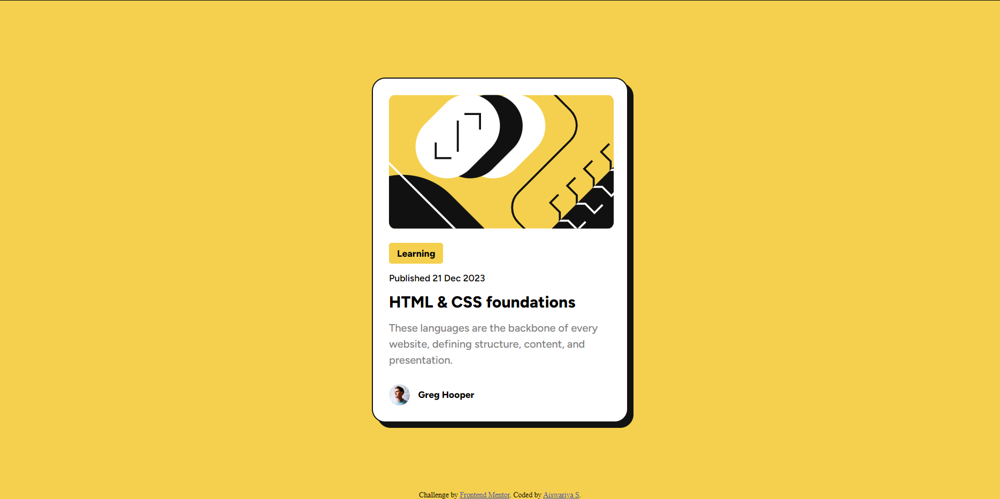

# Frontend Mentor - Blog preview card solution

This is a solution to the [Blog preview card challenge on Frontend Mentor](https://www.frontendmentor.io/challenges/blog-preview-card-ckPaj01IcS). Frontend Mentor challenges help you improve your coding skills by building realistic projects.

## Table of contents

- [Overview](#overview)
  - [The challenge](#the-challenge)
  - [Screenshot](#screenshot)
  - [Links](#links)
- [My process](#my-process)
  - [Built with](#built-with)
  - [What I learned](#what-i-learned)
  - [Continued development](#continued-development)
  - [Useful resources](#useful-resources)
- [Author](#author)
- [Acknowledgments](#acknowledgments)

## Overview

### The challenge

Users should be able to:

- See hover and focus states for all interactive elements on the page

### Screenshot



### Links

- Live Site URL: [Blog-Preview-Card](https://blog-preview-card-fm-2.netlify.app)

## My process

### Built with

- Semantic HTML5 markup
- CSS custom properties
- Flexbox
- Mobile-first workflow

### What I learned

This project was a great opportunity to practice and reinforce my knowledge of HTML and CSS, particularly in creating responsive designs and implementing hover and focus states for interactive elements. Here are a few specific code snippets that I am proud of:

Using Flexbox for layout:

```css
html,
body {
  display: flex;
  justify-content: center;
  align-items: center;
  height: 100vh;
  margin: 0;
  background-color: hsl(47, 88%, 63%);
}
```

Styling the card component and its hover effect:

```css
.card {
  background-color: hsl(0, 0%, 100%);
  border-color: hsl(0, 0%, 7%);
  max-width: 380px;
  border-style: solid;
  border-width: 2px;
  border-radius: 20px;
  box-shadow: 8px 8px 0 hsl(0, 0%, 7%);
  position: relative;
  justify-content: center;
  align-items: center;
  line-height: 150%;
  overflow: hidden;
  transition: box-shadow 0.3s ease;
}

.card:hover {
  box-shadow: 16px 16px 0 hsl(0, 0%, 7%);
}
```

### Continued development

In future projects, I aim to further improve my understanding and implementation of:

- Advanced CSS techniques and animations
- Accessibility best practices
- Responsive design patterns

### Useful resources

- [CSS Tricks - A Complete Guide to Flexbox](https://css-tricks.com/snippets/css/a-guide-to-flexbox/) - This guide was very helpful in understanding how to effectively use Flexbox for layout.
- [MDN Web Docs - CSS Custom Properties](https://developer.mozilla.org/en-US/docs/Web/CSS/Using_CSS_custom_properties) - This resource helped me understand and use CSS custom properties (variables) efficiently.

## Author

- Frontend Mentor - [@Aiswariya3a](https://www.frontendmentor.io/profile/Aiswariya3a)

## Acknowledgments

Special thanks to the Frontend Mentor community for their support and feedback. This project was a great learning experience, and the community's input was invaluable.
